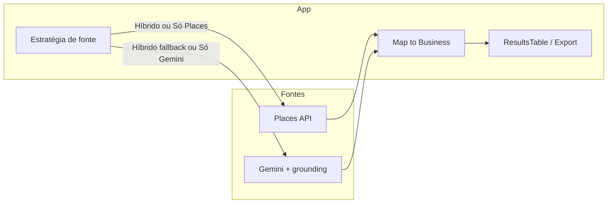

# Plano: modo híbrido com Places API

## Objetivo

Permitir buscas usando **Places API** (crédito grátis ~US$ 200/mês) primeiro e, opcionalmente, **Gemini** quando quiser mais resultados ou quando Places falhar/estourar cota. Tudo continua retornando o mesmo tipo `SearchResult` e `Business` para a tabela e o export.

## Arquitetura

- **Places**: chamadas REST a `places:searchText` (e paginação por `nextPageToken`). Chave: Google Cloud (Places API ativada no projeto).
- **Gemini**: fluxo atual em [geminiService.ts](services/geminiService.ts).
- **Estratégia**: nova configuração na UI (ex.: select "Fonte: Híbrido (Places primeiro) | Só Places | Só Gemini"). No híbrido, cada “lote” tenta Places; se retornar resultados, mapeia e soma ao goal; se falhar ou não houver mais página e ainda faltar meta, usa Gemini para o restante.

## Implementação

### 1. Chave e configuração

- **Places** usa **Google Cloud API Key** (não a do AI Studio). Duas opções:
  - **A)** Dois campos na UI: “Chave Gemini” e “Chave Google Cloud (Places)”, ou
  - **B)** Uma chave só: se for Google Cloud, usar para Places; se for AI Studio, só Gemini (e híbrido desabilitado até ter as duas).
- Recomendação: **dois campos** (ou duas env vars: `GEMINI_API_KEY` e `GOOGLE_CLOUD_API_KEY`). No híbrido, ambas obrigatórias; em “Só Gemini”, só Gemini; em “Só Places”, só Places.
- Persistir no IndexedDB (junto da [SearchConfig](types.ts)) qual **fonte** foi usada na última busca, para restaurar ao reabrir (opcional mas útil).

### 2. Novo serviço: Places

- **Arquivo**: `services/placesService.ts`.
- **Método**: `search(query: string, location?: { lat, lng }, pageToken?: string) => Promise<SearchResult>`.
- **API**: POST `https://places.googleapis.com/v1/places:searchText` com body `{ textQuery: query, maxResultCount: 20 }` (e `locationBias` se tiver `location`). Ver [Text Search (New)](https://developers.google.com/maps/documentation/places/web-service/text-search).
- **Field mask**: pedir só o necessário para mapear para [Business](types.ts): `displayName`, `formattedAddress`, `nationalPhoneNumber`, `rating`, `userRatingCount`, `websiteUri`, `types` (ou `primaryType`). Assim o custo por request fica no tier mais barato.
- **Resposta**: normalizar para `Business[]` (id a partir de `place_id`, category a partir de `types`/primaryType, description vazio ou “[Places API]”, facebook/instagram vazios). Calcular `estimatedCost` por request (ex.: SKU “Text Search”) para exibir no header; enquanto estiver no crédito grátis, pode mostrar “0” ou “crédito”.
- **Paginação**: se a resposta vier com `nextPageToken`, o App pode chamar de novo com esse token para o próximo “lote” até atingir a meta ou acabar os resultados.
- **Exclusão**: Places não aceita “excluir nomes”. No App, após cada lote, filtrar `result.businesses` por `!knownNamesSet.has(b.name)` e só adicionar os novos (como já faz com Gemini).

### 3. Camada de estratégia (híbrido)

- **Opção A – no App**: em [App.tsx](App.tsx), dentro do `while` de `executeSearch`, conforme a fonte escolhida:
  - **Só Gemini**: como hoje; uma ou mais chamadas a `LeadExtractorService.search`.
  - **Só Places**: chamar `PlacesService.search` (e, se houver `nextPageToken`, repetir com o token); acumular em `localResults` e `knownNamesSet`; parar ao atingir goal ou sem mais token.
  - **Híbrido**: por “rodada” (ex.: até 20 novos por vez): (1) tentar Places (uma página); (2) mapear e adicionar só novos; (3) se ainda `leadsFoundInSession < goal` e Places não retornou token ou deu erro (ex.: 429), chamar Gemini uma vez com `excludeNames`; (4) repetir até goal ou abort.
- **Opção B – serviço único**: criar `HybridLeadService` que recebe (query, location, excludeNames, sourceMode) e internamente chama Places e/ou Gemini e retorna um único `SearchResult`. O App continua com um único `service.search(...)`.
- Recomendação: **Opção A** para reaproveitar o loop e o tratamento de erro já existentes, e evitar duplicar lógica de cooldown/abort.

### 4. Ajustes no App

- Estado: `sourceMode: 'gemini' | 'places' | 'hybrid'` (ou string única para o select).
- UI: select “Fonte” com as três opções; em “Places” ou “Híbrido”, mostrar/validar a segunda chave (Google Cloud).
- Custo: no header, mostrar algo como “Investimento IA: $X” (Gemini) e, se usar Places, “Places: Y chamadas (crédito)” ou “$Z” quando quiser mostrar custo estimado após o crédito.
- Salvamento da config: incluir `sourceMode` em [SearchConfig](types.ts) e em [storageService.saveSearchConfig](services/storageService.ts) para restaurar “última busca” com a mesma fonte.
- Cooldown: para Places, usar um delay menor entre páginas (ex.: 1–2 s) para não bater em rate limit; manter 20 s entre lotes Gemini quando usar Gemini.

### 5. Tratamento de erros e limites

- **Places 429 / quota**: tratar como “falha do lote”; no híbrido, cair para Gemini nessa rodada; em “Só Places”, mostrar mensagem e pausar (como hoje com Gemini).
- **Chave Places inválida**: desabilitar “Só Places” e “Híbrido” ou mostrar aviso até a chave ser preenchida/válida.

### 6. Testes e documentação

- Testar: “Só Places” com uma query; “Híbrido” com meta > 20 para forçar segunda página ou Gemini; “Só Gemini” igual hoje.
- README ou tooltip: explicar que Places usa Google Cloud API Key e que há crédito grátis mensal; link para ativar Places API e criar/restringir chave.

## Resumo de arquivos

| Arquivo                                         | Ação                                                                                                                                                                     |
| ----------------------------------------------- | ------------------------------------------------------------------------------------------------------------------------------------------------------------------------ |
| [types.ts](types.ts)                            | Incluir `sourceMode` em `SearchConfig` (opcional).                                                                                                                       |
| [storageService.ts](services/storageService.ts) | Salvar/carregar `sourceMode` na config da última busca.                                                                                                                  |
| **Novo** `services/placesService.ts`            | Classe/service com `search()` que chama Places API e retorna `SearchResult` (lista de `Business` + custo estimado).                                                      |
| [App.tsx](App.tsx)                              | Select de fonte; segundo campo de chave (Places); no loop de `executeSearch`, ramificar por fonte (Places só / Gemini só / híbrido); persistir e restaurar `sourceMode`. |
| [.env.local](.env.local)                        | Documentar `GOOGLE_CLOUD_API_KEY` (ou segundo campo na UI apenas).                                                                                                       |

## Ordem sugerida

1. Implementar `placesService.ts` (search + mapeamento para `Business` + custo).
2. Adicionar estado e UI de “Fonte” e segunda chave no App.
3. Integrar “Só Places” no loop (paginação + exclude por nome no App).
4. Integrar “Híbrido” (Places primeiro, fallback Gemini).
5. Persistir/restaurar `sourceMode` na config e ajustar exibição de custo (Gemini + Places).

## Observação

- **CORS**: Chamadas a `places.googleapis.com` a partir do browser são permitidas com API key restrita por referrer (HTTP referrer ou origem). Não é obrigatório backend; se no futuro a chave precisar ficar escondida, pode-se adicionar um proxy mínimo.

